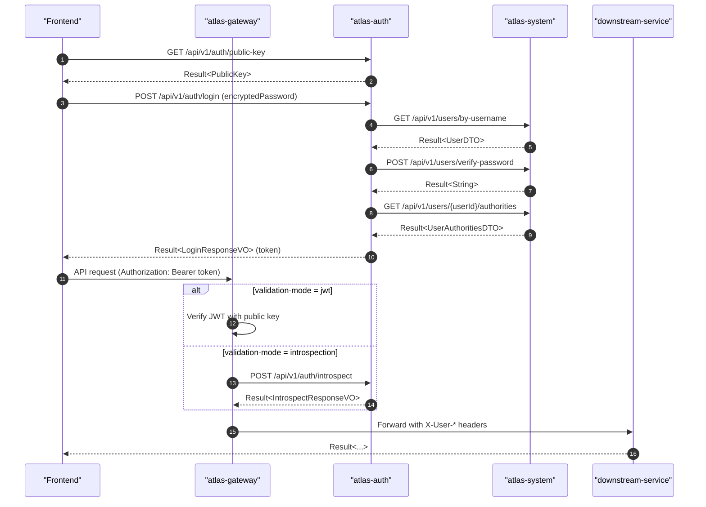

# 登录逻辑文档（Gateway + Auth）

> 基于当前 `atlas-gateway` 与 `atlas-auth` 实现，描述登录、鉴权与上下文透传的完整链路。

## 1. 组件与职责

- **atlas-auth**：用户登录、Token 签发/校验、Token 黑名单、验证码、公钥与 Introspection 接口
- **atlas-gateway**：请求鉴权入口，白名单放行，Token 校验（JWT 或 Introspection）
- **atlas-common-infra-web**：下游服务 `SecurityContextFilter`，从网关头或 Token 构建 `LoginUser`

## 2. 登录流程（Auth 服务）

### 2.1 登录接口
- `POST /api/v1/auth/login`
- 请求体（`LoginRequestVO`）
  - `username`
  - `encryptedPassword`（前端用 RSA 公钥加密）
  - `captchaKey` / `captchaCode`（验证码开启时必填）

### 2.2 登录校验步骤（`AuthServiceImpl.login`）
1. 参数校验：用户名、加密密码不能为空
2. 验证码校验（`authProperties.captcha.enabled` 为 true 时）
3. RSA 解密密码（`RsaPasswordDecryptor`）
4. 调用 `atlas-system` 查询用户信息（`UserQueryApi.getUserByUsername`）
5. 校验用户状态（ACTIVE / INACTIVE / LOCKED / DELETED）
6. 调用 `atlas-system` 验证密码（`UserQueryApi.verifyPassword`）
7. 查询用户角色与权限（`PermissionQueryApi.getUserAuthorities`）
8. 生成 JWT（`TokenService.generateToken`）并解析补全 `tokenId`/`iat`/`exp`
9. 保存会话（`SessionService.saveSession`）
10. 返回登录响应（`LoginResponseVO`）

### 2.3 Token 生成
- `JwtUtil.generateToken` 使用 RSA 私钥签名（RS256）
- Payload 包含：`userId`、`username`、`roles`、`permissions`
- `jti` 作为 `tokenId`，`iat`/`exp` 由 `jwtConfig.expire` 控制

### 2.4 退出登录
- `POST /api/v1/auth/logout`
- 从 `Authorization: Bearer` 解析 Token
- 验证 Token 有效性 → 加入黑名单 → 删除会话

## 3. Gateway 鉴权流程

### 3.1 白名单
- 由 `atlas.gateway.whitelist.paths` 配置
- 默认包含：
  - `/atlas-auth/api/v1/auth/login`
  - `/atlas-auth/api/v1/auth/public-key`
  - `/health/**`、`/mock/**`

白名单命中直接放行，不做 Token 校验。

### 3.2 非白名单鉴权
由 `AuthGatewayFilter` 触发 `GatewayTokenValidator.validate(exchange)`。

### 3.3 校验方式（两种）

#### A. JWT 校验（`JwtGatewayTokenValidator`）
- 从 `Authorization: Bearer` 提取 Token
- 使用网关配置公钥验证签名
- 成功后注入请求头：
  - `X-User-Id`
  - `X-Username`
  - `X-User-Roles`
  - `X-User-Permissions`

#### B. Introspection 校验（`IntrospectGatewayTokenValidator`）
- 调用 Auth 的 `/api/v1/auth/introspect`
- `data.active=true` 才放行
- 同样注入 `X-User-*` 头

#### C. 未配置公钥
- `DefaultGatewayTokenValidator` 会拒绝非白名单请求并返回 401

### 3.4 网关失败响应
- 错误码：`013001`
- HTTP 状态：401
- 统一 `Result` 格式

## 4. 下游服务安全上下文（`SecurityContextFilter`）

1. 优先读取网关注入的 `X-User-*` 头
2. 如果没有网关头，则读取 `Authorization: Bearer` 并委托 `TokenValidator`
3. 构建 `LoginUser` 并写入 `SecurityContextHolder`
4. 请求结束自动清理上下文

## 5. Token 验证逻辑（Auth 内部）

- `TokenService.validateToken`：
  - `JwtUtil.parseToken` 校验签名与过期
  - 查询黑名单（Redis）
  - 无效返回 `null`

## 6. 关键接口清单

### Auth 服务
- `POST /api/v1/auth/login`
- `POST /api/v1/auth/logout`
- `GET /api/v1/auth/public-key`
- `GET /api/v1/auth/captcha`
- `POST /api/v1/auth/introspect`

### System 服务（Auth 依赖）
- `GET /api/v1/users/by-username`
- `POST /api/v1/users/verify-password`
- `GET /api/v1/users/{userId}/authorities`

## 7. 配置要点（网关）

示例（`atlas-gateway-dev.yaml`）：

```yaml
atlas:
  gateway:
    whitelist:
      enabled: true
      paths:
        - /atlas-auth/api/v1/auth/login
        - /atlas-auth/api/v1/auth/public-key
    auth:
      validation-mode: introspection # jwt 或 introspection
      jwt:
        public-key: ${ATLAS_GATEWAY_JWT_PUBLIC_KEY:}
      introspect:
        url: http://localhost:8084/atlas-auth/api/v1/auth/introspect
        api-key: ${ATLAS_GATEWAY_INTROSPECT_API_KEY:}
```

## 8. 时序概览

1. 前端调用 `/atlas-auth/api/v1/auth/public-key` 获取公钥
2. 登录 `/atlas-auth/api/v1/auth/login` 获取 `token`
3. 前端携带 `Authorization: Bearer {token}` 请求业务接口
4. Gateway 校验 token，注入 `X-User-*` 头
5. 下游服务基于 `SecurityContextHolder` 获取用户与权限信息

## 9. 时序图



## 10. 请求/响应 JSON 示例

### 10.1 获取公钥

**请求**
```http
GET /api/v1/auth/public-key
```

**响应**
```json
{
  "code": "000000",
  "message": "操作成功",
  "data": {
    "algorithm": "RS256",
    "publicKey": "-----BEGIN PUBLIC KEY-----\\n...\\n-----END PUBLIC KEY-----",
    "keyId": "key-2025-01-06"
  },
  "timestamp": 1704542400000,
  "traceId": "abc123"
}
```

### 10.2 登录

**请求**
```http
POST /api/v1/auth/login
Content-Type: application/json

{
  "username": "admin",
  "encryptedPassword": "Base64(RSA公钥加密后的密码)",
  "captchaKey": "uuid-from-GET-/captcha",
  "captchaCode": "a1b2"
}
```

**响应**
```json
{
  "code": "000000",
  "message": "登录成功",
  "data": {
    "token": "eyJhbGciOiJSUzI1NiIsInR5cCI6IkpXVCJ9...",
    "tokenType": "Bearer",
    "expiresIn": 7200,
    "user": {
      "userId": 1,
      "username": "admin",
      "nickname": "管理员",
      "email": "admin@example.com"
    }
  },
  "timestamp": 1704542400000,
  "traceId": "abc123"
}
```

### 10.3 Introspection（网关校验）

**请求**
```http
POST /api/v1/auth/introspect
Content-Type: application/json

{
  "token": "eyJhbGciOiJSUzI1NiIsInR5cCI6IkpXVCJ9..."
}
```

**响应（有效）**
```json
{
  "code": "000000",
  "message": "操作成功",
  "data": {
    "active": true,
    "userId": 1,
    "username": "admin",
    "roles": ["admin", "user"],
    "permissions": ["user:read", "user:write"],
    "expiresAt": 1704549600
  },
  "timestamp": 1704542400000,
  "traceId": "abc123"
}
```

**响应（无效）**
```json
{
  "code": "000000",
  "message": "操作成功",
  "data": {
    "active": false
  },
  "timestamp": 1704542400000,
  "traceId": "abc123"
}
```

### 10.4 网关鉴权失败

**响应**
```json
{
  "code": "013001",
  "message": "Token 校验失败",
  "data": null,
  "timestamp": 1704542400000,
  "traceId": "abc123"
}
```
